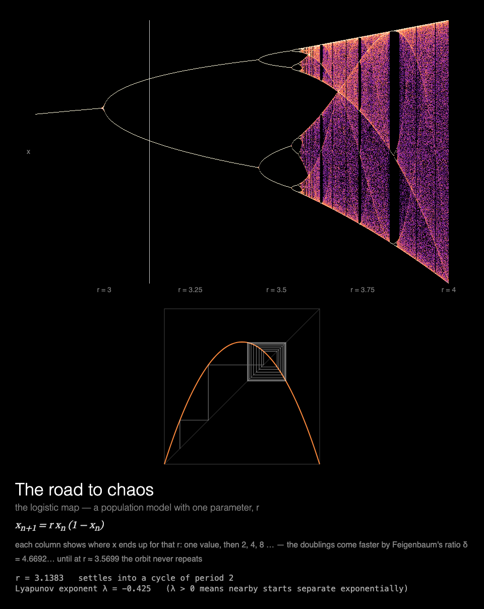

# MMM-LogisticMap

A [MagicMirror²](https://magicmirror.builders/) module that paints the logistic map's bifurcation diagram, then sweeps a cobweb diagram through period doubling into chaos, drawn for a Raspberry Pi without a GPU.



## What you see

**The road to chaos.** The logistic map's bifurcation diagram paints itself, column by column:
for each r, where x ends up in the long run, one value, then 2, 4, 8… Then a cobweb diagram
below sweeps r back and forth through period doubling into chaos, with its r marked on the
diagram above: the orbit spirals into a cycle while r is periodic and scribbles everywhere in
chaos.

Under the diagrams: the map's equation and a note on Feigenbaum's ratio, and a readout of the
current r, the period the orbit settles into (or that it never repeats), and its Lyapunov
exponent.

The diagram takes 12 s to paint and a sweep from r = 2.8 to 4 another 40 s, so a page of about
a minute shows both. It starts again each time the module is shown.

Built for a **Raspberry Pi 3 without GPU acceleration**: everything is drawn by the CPU, each
frame changes only a small part of the canvas, and the animation stops while the module is
hidden (see [Performance](#performance)).

## Installation

```bash
cd ~/MagicMirror/modules
git clone https://github.com/charleswest775/MMM-LogisticMap
```

No npm dependencies: there is nothing to install.

## Update

```bash
cd ~/MagicMirror/modules/MMM-LogisticMap
git pull
```

## Configuration

```js
{
	module: "MMM-LogisticMap",
	position: "middle_center",
	config: {
		cycleSeconds: 600,  // longer than the page is shown: start again only when shown again
		width: 900,
		height: 900,
		fps: 20
	}
},
```

| Option | Default | Description |
|---|---|---|
| `paintSeconds` | `12` | Seconds to paint the bifurcation diagram |
| `sweepSeconds` | `40` | Seconds for the cobweb's sweep across r, each way |
| `cycleSeconds` | `60` | Start again this often; it also starts again each time the module is shown |
| `width`, `height` | `900` | Canvas size in pixels |
| `fps` | `20` | Frame-rate cap |
| `showMath` | `true` | Equations and live numbers under the canvas |
| `turns` | `null` | Take turns with other modules on the same page, e.g. `{ of: 2, at: 1 }` (see [Taking turns](#taking-turns)) |
| `statsPanel` | `false` | A line under the math showing what the mirror spends: fps, CPU of Electron and the compositor, a bar per core, temperature, and the time to the next start. Sampled by the module's `node_helper` from `/proc`, only while the module is shown |
| `debugStats` | `false` | Show achieved fps and per-frame timings in the corner of the screen |

## Taking turns

With `turns: { of: n, at: k }`, modules on the same [MMM-pages](https://github.com/edward-shen/MMM-pages)
page each show on their own one in n showings of it: `at: 0` on the first showing and every
nth after it, `at: 1` on the second, and so on. A module that isn't on its turn takes no room on
the page and costs nothing: it hides its canvas and doesn't start. So one slot in the rotation
can hold several pages, without making the rotation longer. For example, a chaos page of a
minute with the logistic map, [MMM-FractalBasins](https://github.com/charleswest775/MMM-FractalBasins)
and [MMM-SymmetricIcons](https://github.com/charleswest775/MMM-SymmetricIcons), one per showing:

```js
{
	module: "MMM-LogisticMap",
	classes: "page-chaos",
	position: "middle_center",
	config: { turns: { of: 3, at: 0 } }
},
{
	module: "MMM-FractalBasins",
	classes: "page-chaos",
	position: "middle_center",
	config: { turns: { of: 3, at: 1 } }
},
{
	module: "MMM-SymmetricIcons",
	classes: "page-chaos",
	position: "middle_center",
	config: { turns: { of: 3, at: 2 } }
},
{
	module: "MMM-pages",
	config: { modules: [["page-clock"], ["page-chaos"]], rotationTime: 60000 }
},
```

Without `turns` the module shows every time. It works just as well on a page of its own, or in
a normal region without MMM-pages, where it starts again every `cycleSeconds`.

## What's real

The logistic map, x → r x (1 − x), is a population model with one parameter, r
(`simulations/logistic.js`). Each column of the diagram is one r between 2.8 and 4: the map is
iterated from x = 0.5 for 400 steps to forget where it started, then 600 more, and how often x
falls in each pixel row is shown on a log scale, so that faint chaotic bands and bright periodic
points both show. Only the new columns are put to the canvas each frame.

The cobweb diagram draws the parabola y = r x (1 − x), the diagonal, and 150 steps of the orbit
from x₀ = 0.1: up to the curve, across to the diagonal, and again. r sweeps from 2.8 to 4 and
back, easing at the ends.

The readout computes what the picture shows, twice a second: the period, by iterating 20,000
steps and then looking for the orbit's return (to within 10⁻⁷, up to period 64; none found is
chaos), and the Lyapunov exponent, the average of ln |r (1 − 2x)| along the orbit, the rate at
which nearby starts separate: negative in a cycle, positive in chaos.

The tests check the map against known results: periods 1, 2, 4 and 8 and then chaos; the
period-3 window opening at r = 1 + √8; the first bifurcation points (r = 3, 1 + √6, 3.54409),
found by bisection, and their first ratio, ≈ 4.751, on its way to Feigenbaum's 4.6692; and the
Lyapunov exponent, negative when periodic, positive in chaos, and ln 2 at r = 4.

## Performance

Measured on a Raspberry Pi 3 B+ (Electron 42, software rendering), 900×900 at 20 fps over 60 s,
as CPU of the Electron processes plus the `cage` compositor, in % of one core (the Pi has
four); baseline mirror without the module: 0.2%.

| | % of one core | achieved fps |
|---|---|---|
| module **hidden** (e.g. another MMM-pages page) | 0.3 | 0 |
| shown | 73 | 17 |

While the diagram paints, each frame puts only its new columns to the canvas. During the sweep
each frame redraws only the cobweb's square; the marker on the diagram above moves just twice a
second, so that most frames don't touch both. The cobweb keeps moving, so the module doesn't
rest while it is shown.

Why it costs what it does, from micro-benchmarks on the Pi:

- There is no GPU acceleration to be had (the Pi 3's GPU only does GLES 2.0; Chromium needs
  3.0), so every pixel is drawn by the CPU.
- Any frame that changes the canvas costs ~2% of a core per fps, before drawing anything.
- On top of that, cost grows with the **area that changes**: Chromium redraws the bounding box
  of everything touched in a frame. So each frame changes one compact part of the canvas.
- JavaScript is not the bottleneck: step and draw take 0.1–3 ms per frame.
- The frame loop sleeps with `setTimeout` until a frame is due. While MagicMirror² fades the
  module out, nothing new is drawn; once it is hidden, the loop stops.

## Development

```bash
node --test                  # checks against known results (no dependencies)
python3 -m http.server       # then open http://localhost:8000/dev/preview.html
```

`dev/preview.html` runs the module outside MagicMirror², in a portrait 1200×1920 frame, with
hide/show buttons that follow MagicMirror²'s suspend/resume order. Query options override the
config, e.g. `?paintSeconds=4&sweepSeconds=20` to see it all sooner, or
`?width=700&height=700&fps=12`.

## License

MIT

Part of a family of MagicMirror² modules:
[MMM-ChaosTheory](https://github.com/charleswest775/MMM-ChaosTheory) (all eight chaos simulations in one module),
[MMM-LorenzAttractor](https://github.com/charleswest775/MMM-LorenzAttractor),
[MMM-DoublePendulum](https://github.com/charleswest775/MMM-DoublePendulum),
[MMM-FractalBasins](https://github.com/charleswest775/MMM-FractalBasins),
[MMM-SymmetricIcons](https://github.com/charleswest775/MMM-SymmetricIcons),
[MMM-ThreeBody](https://github.com/charleswest775/MMM-ThreeBody),
[MMM-ChaoticBilliards](https://github.com/charleswest775/MMM-ChaoticBilliards) and
[MMM-Rule30](https://github.com/charleswest775/MMM-Rule30);
and beyond chaos, [MMM-Atom](https://github.com/charleswest775/MMM-Atom),
[MMM-FractalZoom](https://github.com/charleswest775/MMM-FractalZoom),
[MMM-Chladni](https://github.com/charleswest775/MMM-Chladni),
[MMM-SacredGeometry](https://github.com/charleswest775/MMM-SacredGeometry),
[MMM-Tilings](https://github.com/charleswest775/MMM-Tilings),
[MMM-PlanetsDance](https://github.com/charleswest775/MMM-PlanetsDance),
[MMM-SnowCrystal](https://github.com/charleswest775/MMM-SnowCrystal) and
[MMM-NightSky](https://github.com/charleswest775/MMM-NightSky).
